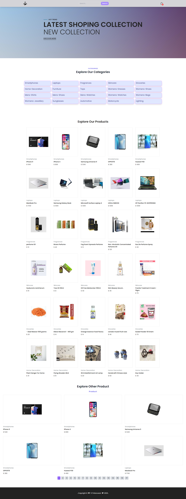
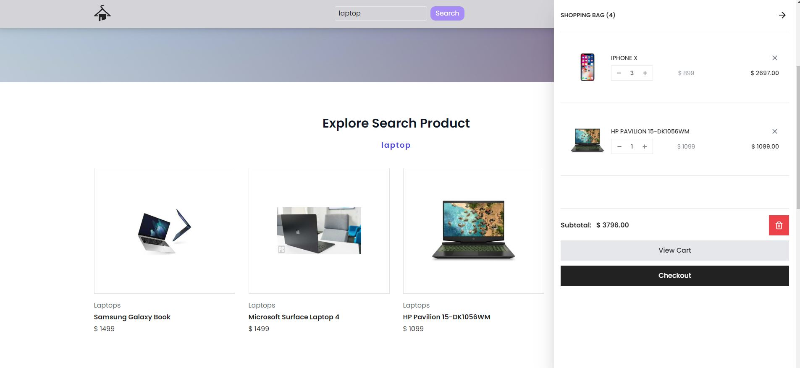

## E-commerce shopping Site using React.Js

## Table of Contents

- [Introduction](#Introduction)
- [Features](#features)
- [Usage](#usage)
- [Technologies Used](#technologies-used)
- [Overview](#overview)
- [Getting Started](#Getting-Started)
- [License](#License)
    
## Introduction

- Create a modern and user-friendly e-commerce website using React Js, Tailwind CSS, 
  and JavaScript. Enjoy seamless browsing, efficient searching, and easy checkout 
  processes for a satisfying shopping experience.
  This project enables users to browse, filter, search for products, and 
  conveniently add them to their cart for a streamlined checkout process.

## Usage

- Browse a diverse range of products on the homepage.
- Use category filters to narrow down products.
- Search for products using keywords.
- Add products to the cart for a streamlined checkout.

## Features

- Product listing with pagination.
- Category filtering for refined search.
- Keyword-based product search.
- Convenient "Add to Cart" functionality.
- User-friendly and responsive interface.

## Technologies Used

- **React:** Building dynamic and interactive user interfaces.
- **Tailwind CSS:** Styling with a responsive and visually appealing approach.
- **JavaScript:** Adding interactivity and dynamic behavior.

## Getting Started

Follow these steps to set up the project on your local machine:

1. Clone the repository:
   ```bash
   git clone https://github.com/your-username/e-commerce-react.git
   ```

2. Navigate to the project directory:
   ```bash
   cd e-commerce-react
   ```

3. Install dependencies:
   ```bash
   npm install
   ```

4. Start the development server:
   ```bash
   npm start
   ```

## Overview

<p align="center">
  <br/><br/>
  <br/>
</p>

## License

- This project is licensed under the MIT License. 
  Feel free to use, modify, and distribute the code as per the terms.